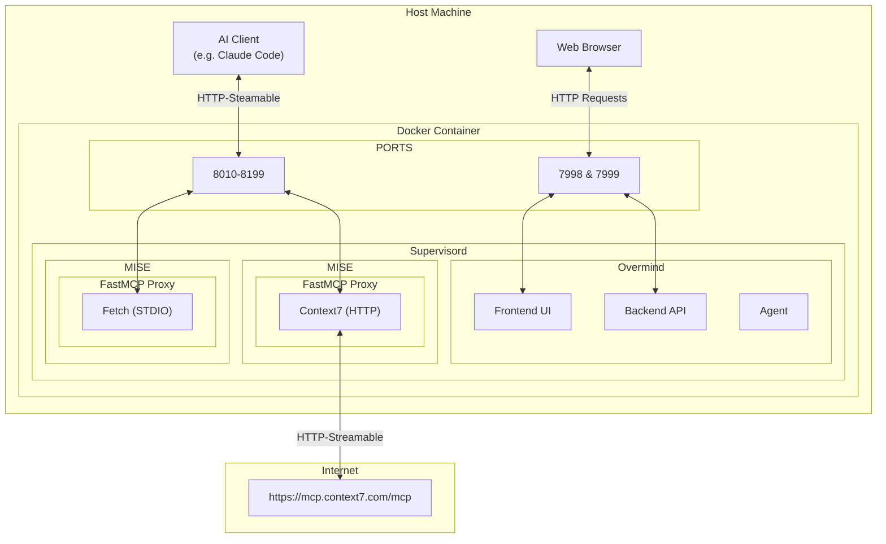

# 🦁 MCPZoo 

A single docker container to run, manage, and monitor MCP servers in isolation.

[](https://opensource.org/licenses/BSD-3-Clause) [](https://docker.com)

---

## 🚀 Quick Start
```bash
docker run -p 7998-8199:7998-8199 \
    -e APP_USERNAME=admin \
    -e APP_PASSWORD=changeme123 \
    veloper/mcpzoo:latest
```

1. Open [http://localhost:7999](http://localhost:7999) and login with `$APP_USERNAME` / `$APP_PASSWORD`
2. Navigate to "Servers" → Click "Add Server" 
3. Click "Sync Servers" 
4. Connect...

Each server is proxied on a unique port over the http-streamable transport. For example, if you added two servers Context7 and Fetch, they would be available at:

```json
{
    "mcpServers": {
        "context7" : {
            "type": "http",
            "url": "http://localhost:8010/mcp",
        },
        "fetch" : {
            "type": "http",
            "url": "http://localhost:8011/mcp",
        }
    }
}
```

---

## 📖 Overview

MCPZoo simplifies the management of multiple Model Context Protocol (MCP) servers by providing a web-based interface to configure, monitor, and control MCP servers and their dependencies. 


### ✨ Features

- 🖥️ **Server Management**: Quick web UI to add and config STDIO/HTTP/SSE MCP servers.
- 🔐 **Secure Login**: JWT auth for protected web access.
- 🔗 **Proxy Access**: HTTP-streamable ports (8010-8199) for AI client connections.
- ⚙️ **Dependencies:** Isolated setups via MISE-EN-PLACE for clean environments.
- 📊 **System Monitoring**: Live process trees, CPU/memory charts, and history.
- 🐳 **Docker Ready**: One-container deploy with Supervisor for easy control.

---

### 🏗️ Architecture




---

### 🔧 Configuration

**Environment Variables**
```bash
# Application
APP_USERNAME=admin
APP_PASSWORD=changeme123

# Database
SQLITE_PATH=./data/mcpzoo.db

# JWT
JWT_SECRET=your-secret-key-here-change-in-production
JWT_ALGORITHM=HS256
JWT_EXPIRATION_DAYS=7
JWT_TOKEN_REFRESH_DAYS=7

# Server Ports (internal)
BACKEND_WEB_PORT=7998
FRONTEND_WEB_PORT=7999

# Logging
LOG_LEVEL=INFO

# Process Snapshot Retention
PROCESS_SNAPSHOT_RETENTION_MINUTES=15
```

---

## 🤝 Contributing

1. Fork the repository
2. Create a feature branch (`git checkout -b feature/amazing-feature`)
3. Commit changes (`git commit -m 'Add amazing feature'`)
4. Push to branch (`git push origin feature/amazing-feature`)
5. Open a Pull Request

## 📄 License

This project is licensed under the BSD-3-Clause License. See the [LICENSE](LICENSE) file for details.

## 🌟 Acknowledgments

Built on the shoulders of giants:
[Docker](https://www.docker.com/), [Supervisor](http://supervisord.org/), [FastAPI](https://fastapi.tiangolo.com/), [React JS](https://reactjs.org/), [FastAPI](https://fastapi.tiangolo.com/), [FastMCP](https://github.com/jlowin/fastmcp), [Shedcn UI](https://shedcn.github.io/ui/), [Overmind](https://github.com/DarthSim/overmind), [MISE-EN-PLACE](https://mise.jdx.dev/), [Python](https://www.python.org/), [Linux](https://www.linux.org/), and the open source community.

---

**MCPZoo** - Taming MCP servers since 2026 🦁